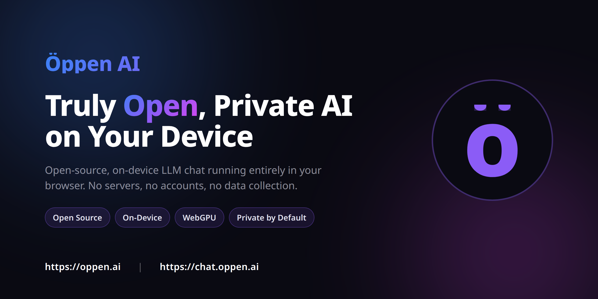

# Öppen AI



Truly open, private AI chat that runs entirely on your device. No servers, no cloud, no accounts - just private conversation powered by on-device LLMs.

* Phase 1: First implementation is provided as a web-based static HTML page using WebGPU
* Phase 2: iPhone app

## Supported Devices

- Apple Silicon
- Other: coming soon

**Live:** [oppen.ai](https://oppen.ai) | **Chat:** [chat.oppen.ai](https://chat.oppen.ai)

## Toolchain (Nix flake)

All tooling for this repo lives in `flake.nix` - Node.js, npm, Playwright browsers, AWS CLI, jq, curl, etc. You don't need to install any of them globally.

**Prerequisites:** [Nix](https://nixos.org/download) with flakes enabled (`experimental-features = nix-command flakes`).

Enter the dev shell from the repo root:

```bash
nix develop
```

You're now in a shell with everything pinned. Every command below assumes you are inside this shell. If you prefer one-shot commands, prefix them with `nix develop --command`, e.g. `nix develop --command npm test`.

The shell sets `PLAYWRIGHT_BROWSERS_PATH` to the Nix-provided browser bundle, so `npx playwright install` is **not** needed - the correct Chromium revision is already available.

## Local Development

### Website (landing page)

```bash
nix develop
cd website
npx serve -l 8878
```

Open http://localhost:8878. Static files including `index.html` and `privacy.html` are served as-is.

> Note: do **not** pass `-s` to `serve`. Single-page mode rewrites unknown routes to `index.html`, which breaks the privacy page.

### Chat App

```bash
nix develop
cd webchat
npm install
npm run dev
```

Vite dev server starts on http://localhost:5173 by default.

### Build the chat app

```bash
nix develop
cd webchat
npm run build        # tsc + vite build, output in dist/
```

### Run tests

```bash
nix develop
cd webchat
npm test             # playwright - 73 tests, ~40s
```

Playwright uses the pinned Chromium from the flake; no separate browser install step.

## Web Chat Scripts

Scripts live in `webchat/scripts/` and use Playwright. They work the same way - just run them from inside `nix develop`.

### Website Generate OG image

Captures the hero section of the landing page at 1200x630 @2x for social media previews.

```bash
nix develop
cd webchat
node scripts/capture-og-image.mjs                          # auto-serves website/ locally
node scripts/capture-og-image.mjs --url https://oppen.ai   # from production
```

Output: `website/og-image.png`

### Capture app screenshots

Captures desktop & mobile screenshots of the chat app (home, typing, chat, loading states).

```bash
nix develop
cd webchat
node scripts/capture-app-screenshots.mjs                              # from https://chat.oppen.ai
node scripts/capture-app-screenshots.mjs --url http://localhost:5173  # from local dev
```

Output: `website/img/app-*.png`

### Capture website previews

Captures each section of the landing page (hero, features, showcase, etc.).

```bash
nix develop
cd webchat
node scripts/capture-website-previews.mjs --url https://oppen.ai
```

Output: `.temp/preview-*.png`

### Generate favicons & PWA icons

Renders `src/logo.svg` at all required sizes using Chromium for correct gradient rendering.

```bash
nix develop
cd webchat
node scripts/generate-icons.mjs
```

Output: `public/icons/`, `public/favicon.ico`, `public/favicon.svg`

### Generate GitHub repo social preview (OG image)

Renders a 1280x640 PNG matching the site palette for GitHub's repo "Social preview" (Settings → General → Social preview) and for the image shown at the top of this README. Follows the 40pt safe-zone guideline from `website/img/repository-open-graph-template.png`.

```bash
nix develop
cd webchat
node scripts/generate-repo-og-image.mjs
```

Output: `website/img/repository-open-graph.png`

## Build & Deploy

Both projects' `build.sh` / `deploy.sh` scripts use `aws`, `jq`, and `curl` - all provided by the flake, so you can run them directly inside `nix develop`.

### Prerequisites

Create a `.env` file from the example template in each project:

```bash
cp website/infra/.env.example website/.env   # landing page
cp webchat/infra/.env.example webchat/.env   # chat app
```

Fill in S3 bucket names, AWS credentials, Cloudflare API token and zone ID.

### Website (oppen.ai)

```bash
nix develop

# Build - packages static files into a timestamped artifact
website/infra/build.sh

# Deploy to production
website/infra/deploy.sh prd

# Deploy to dev/test
website/infra/deploy.sh dev
website/infra/deploy.sh test

# Dry run - validates credentials and config without uploading
website/infra/deploy.sh prd --test

# Deploy a specific artifact
website/infra/deploy.sh prd --artifact website/infra/artifacts/20260216_143000
```

### Chat App (chat.oppen.ai)

```bash
nix develop

# Build - runs Vite build, creates timestamped artifact
webchat/infra/build.sh

# Deploy to production
webchat/infra/deploy.sh prd

# Deploy to dev/test
webchat/infra/deploy.sh dev
webchat/infra/deploy.sh test

# Dry run
webchat/infra/deploy.sh prd --test
```

## Credits

- WebChat UI design inspired by [chatgpt-lite](https://github.com/blrchen/chatgpt-lite) by [blrchen](https://github.com/blrchen)
