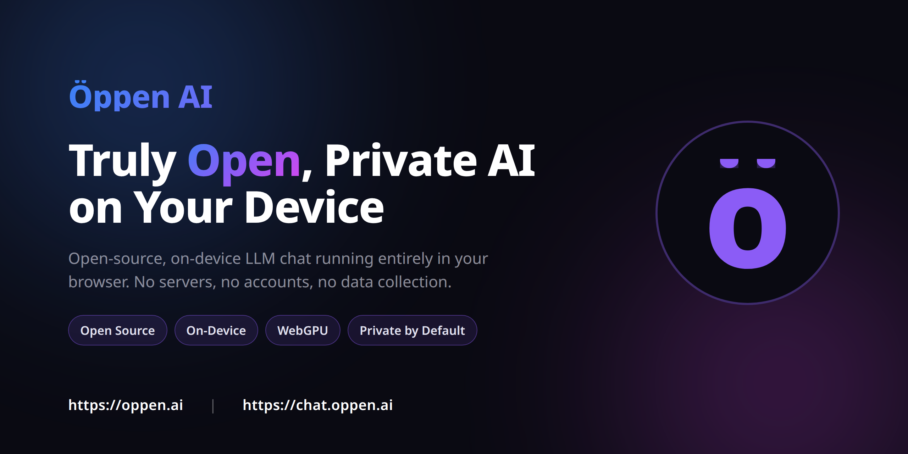

# Öppen AI



Truly open, private AI chat that runs entirely on your device. No servers, no cloud, no accounts - just private conversation powered by on-device LLMs.

**Live:** [oppen.ai](https://oppen.ai) | **Chat:** [chat.oppen.ai](https://chat.oppen.ai)

## How it works

Oppen AI runs large language models directly in your browser using WebGPU and WebAssembly. Models range from 135M to 7B parameters (270 MB to 5 GB VRAM) and come with real trade-offs:

- **Small models, small context** - default 4096-token context window (~3000 words). Conversations are automatically truncated to fit; system prompt and most-recent messages are preserved, older history is dropped.
- **Document handling** - PDFs, text files, and images are processed locally. Long text is summarised in batches by the loaded chat model before being injected into the conversation.
- **Image OCR** - Tesseract.js (~4 MB, full-page OCR) extracts text from photos. The browser's `TextDetector` API is tried first when available.
- **Voice input** - browser Web Speech API (default) or on-device Whisper model.
- **Voice output** - tap the speaker icon on a reply to read it aloud via `SpeechSynthesis`. Stays on across replies; chunks word-by-word during slow QRNG generation, phrase-by-phrase otherwise.
- **Encrypted shareable memory** - paste any text + password into Memory → Create to produce a `#/memory/<ciphertext>` URL hash. The URL also carries the chosen model and QRNG settings so the recipient lands on a fully configured chat. AES-256-GCM, 32 KB cap, never leaves the browser.
- **Quantum randomness (experimental, off by default)** - reseeds every token sample with bytes streamed live from the [ANU](https://qrng.anu.edu.au/) quantum optical experiment. Adds a per-prompt quantum-derived temperature too. See the section below.
- **Early preview** - small models hallucinate, get facts wrong, and lose track of long conversations. Treat responses as a starting point, not a source of truth.

## Supported Devices and GPUs

Oppen AI requires a browser with **WebGPU** support and a GPU that can run it. WebGPU is the successor to WebGL and provides direct access to the GPU for compute workloads like LLM inference.

### Browsers

| Browser | Platform | WebGPU Status |
|---|---|---|
| Chrome 113+ | Windows, macOS, Linux, Android | Enabled by default |
| Edge 113+ | Windows, macOS | Enabled by default |
| Safari 18+ | macOS, iOS, iPadOS | Enabled by default |
| Brave | All | Works but may need `brave://flags/#enable-unsafe-webgpu` on Linux |
| Firefox | All | Behind flag (`dom.webgpu.enabled` in `about:config`) |

### GPUs

| GPU | Status | Notes |
|---|---|---|
| **Apple Silicon** (M1/M2/M3/M4) | Best support | Unified memory, works on Mac + iPhone + iPad |
| **Apple A15+** (iPhone 13+) | Works | Mobile Safari 18+ required |
| **NVIDIA GTX 1060+** | Works | Desktop Chrome/Edge, needs up-to-date drivers |
| **NVIDIA RTX series** | Works | Best desktop performance |
| **AMD Radeon RX 5000+** | Works | Desktop Chrome/Edge |
| **AMD RDNA 2/3** | Works | Including Steam Deck |
| **Intel Iris Xe** (11th gen+) | Works | May need `enable-unsafe-webgpu` flag in Brave |
| **Intel Arc** (A-series) | Works | Dedicated GPU, good performance |
| **Intel UHD 600/700** | Limited | Older integrated, may fail on larger models |
| **Qualcomm Adreno 640+** | Limited | Android Chrome, experimental |
| **ARM Mali** | Not supported | No WebGPU support yet |
| **Older NVIDIA (pre-GTX 1060)** | Not supported | Missing required Vulkan features |
| **Older Intel (pre-11th gen)** | Not supported | No WebGPU adapter available |

### Memory requirements

| Model | VRAM needed | Suitable for |
|---|---|---|
| SmolLM2 135M | ~270 MB | Any device, phones |
| Qwen2.5 0.5B | ~400-500 MB | Phones, tablets |
| Llama 3.2 1B | ~900-1100 MB | Tablets, laptops |
| Qwen2.5 1.5B | ~1.6-1.9 GB | Laptops, desktops |
| Llama 3.2 3B | ~2.3 GB | Desktops, Apple Silicon |
| Qwen2.5 3B | ~2.5 GB | Desktops, Apple Silicon |
| Qwen2.5 7B | ~5.1 GB | Desktops with 8GB+ VRAM |

## Troubleshooting

### "WebGPU is not available"

Your browser does not support WebGPU or it is disabled.

- **Chrome/Edge**: update to version 113 or later
- **Safari**: update to Safari 18 or later
- **Firefox**: go to `about:config`, search for `dom.webgpu.enabled`, set to `true`
- **Brave**: go to `brave://flags/#enable-unsafe-webgpu`, set to Enabled, relaunch

### "No available adapters"

WebGPU is available in the browser but it cannot find a usable GPU. This is common on **Linux with Intel integrated GPUs** where the browser does not trust the GPU by default.

**Fix for Brave on Linux:**
1. Go to `brave://flags/#enable-unsafe-webgpu`
2. Set to **Enabled**
3. Relaunch the browser

**Fix for Chrome on Linux (if needed):**
1. Go to `chrome://flags/#enable-unsafe-webgpu`
2. Set to **Enabled**
3. Relaunch

**Check Vulkan drivers (Linux):**
```bash
vulkaninfo --summary
```
If this fails, install the Vulkan drivers for your GPU:
```bash
# Intel
sudo apt install mesa-vulkan-drivers

# NVIDIA
sudo apt install nvidia-driver-535  # or latest

# AMD
sudo apt install mesa-vulkan-drivers
```

### "Cannot reach model server"

The browser cannot connect to HuggingFace to download model weights.

- Check your internet connection
- Disable ad blockers or VPN for `chat.oppen.ai`
- On Safari: Settings - Privacy - disable "Prevent cross-site tracking" for this site
- Corporate firewalls may block `huggingface.co` - ask your IT team

### "Not enough GPU memory" / page crashes

The selected model is too large for your device.

- Switch to a smaller model in the top-right dropdown
- On mobile: use SmolLM2 135M or Qwen2.5 0.5B (under 500 MB)
- Close other GPU-intensive tabs (video, games, other AI tools)

### Service worker cache errors

If you see `Failed to execute 'put' on 'Cache'` in the console:

- Clear site data: browser Settings - Privacy - Site data - clear for `chat.oppen.ai`
- Unregister the service worker: DevTools (F12) - Application - Service Workers - Unregister
- Reload the page

## Quantum randomness (experimental)

Click the atom icon in the chat toolbar (or Settings → Experimental) to flip on real quantum entropy from the [Australian National University's](https://qrng.anu.edu.au/) quantum optical experiment. Off by default.

### What it does

LLMs sample tokens from a probability distribution; that sampling needs randomness. With QRNG on, two things happen:

1. **Per-token reseed.** Before every single token sample, the LLM's RNG is reseeded with 4 bytes of fresh quantum entropy. Every individual word the model picks is anchored to physical quantum noise.
2. **Per-prompt temperature.** When you submit a prompt, one quantum u32 is mapped to a sampling temperature in `[0.5, 1.0]`. Each response gets a different "creativity dial" from the universe.

### How it works

1. The [`qrng-proxy/`](qrng-proxy/) Cloudflare Worker at [`qrng.oppen.ai`](https://qrng.oppen.ai) sits between the browser and ANU. It pulls 4 bytes every 500 ms from ANU's endpoint and broadcasts them to every connected client over WebSocket.
2. The chat app keeps the WebSocket open whenever QRNG is enabled, but **only consumes bytes during active generation** - bytes that arrive while the model is idle are discarded. This guarantees per-token entropy is fresh, not stale-buffered.
3. WebLLM's `sampleTokenFromLogits` is monkey-patched: it awaits the next 4 bytes from the local buffer and calls `setSeed(u32)` before each sample.
4. If the WebSocket can't deliver bytes within a short deadline, the sampler throws `QRNG_STREAM_LOST`. The chat shows *"I lost my quantum random real-time feed"* instead of degrading silently.

The atom icon in the chat toolbar pulses with a tiny orbiting electron every time a quantum byte arrives. Click it to toggle on/off without leaving the chat.

### Limits

- **Throughput** is bounded by ANU. Sustained ~4-8 bytes/sec from the Cloudflare egress IP, which means ~1-2 token reseeds per second. **Generation is noticeably slower with QRNG on.**
- Same byte stream is broadcast to every client - within a refresh window two browsers may consume overlapping bytes. Acceptable for the LLM-seeding use case; not crypto-grade unique-per-call.
- No fallback. If the patch can't be installed for a future WebLLM version, or if the stream stalls, chat refuses to generate. By design.

### Get the bytes yourself

```sh
curl 'https://qrng.oppen.ai/?length=8'
# -> {"success":true,"bytes":[42,17,...],"length":8,"source":"anu-demo",
#     "fetchedAt":<ms>,"ageMs":<ms>,"ts":<ms>}
```

The HTTP endpoint is capped at 64 bytes per request. For continuous streaming, open a WebSocket to the same URL - see [`qrng-proxy/README.md`](qrng-proxy/README.md).

## Toolchain (Nix flake)

All tooling for this repo lives in `flake.nix` - Node.js, npm, Playwright browsers, AWS CLI, jq, curl, etc. You don't need to install any of them globally.

**Prerequisites:** [Nix](https://nixos.org/download) with flakes enabled (`experimental-features = nix-command flakes`).

Enter the dev shell from the repo root:

```bash
nix develop
```

You're now in a shell with everything pinned. Every command below assumes you are inside this shell. If you prefer one-shot commands, prefix them with `nix develop --command`, e.g. `nix develop --command npm test`.

The shell sets `PLAYWRIGHT_BROWSERS_PATH` to the Nix-provided browser bundle, so `npx playwright install` is **not** needed - the correct Chromium revision is already available.

## Local Development

### Website (landing page)

```bash
nix develop
cd website
npx serve -l 8878
```

Open http://localhost:8878. Static files including `index.html` and `privacy.html` are served as-is.

> Note: do **not** pass `-s` to `serve`. Single-page mode rewrites unknown routes to `index.html`, which breaks the privacy page.

### Chat App

```bash
nix develop
cd webchat
npm install
npm run dev
```

Vite dev server starts on http://localhost:5173 by default.

### Build the chat app

```bash
nix develop
cd webchat
npm run build        # tsc + vite build, output in dist/
```

### Run tests

```bash
nix develop
cd webchat
npm test                                   # playwright - all UI specs
RUN_LLM_PIPELINE=1 npm test -- \
    tests/qrng-llm-pipeline.spec.ts \
    --headed --workers=1                   # full LLM + QRNG end-to-end (~40s, downloads model)
```

Playwright uses the pinned Chromium from the flake; no separate browser install step. UI-only specs use a `?noengine=1` query param hatch in `main.ts` (localhost-only) to skip WebLLM load and finish in seconds.

## Build & Deploy

Both projects' `build.sh` / `deploy.sh` scripts use `aws`, `jq`, and `curl` - all provided by the flake, so you can run them directly inside `nix develop`.

### Prerequisites

Create a `.env` file from the example template in each project:

```bash
cp website/infra/.env.example website/.env   # landing page
cp webchat/infra/.env.example webchat/.env   # chat app
```

Fill in S3 bucket names, AWS credentials, Cloudflare API token and zone ID.

### Website (oppen.ai)

```bash
nix develop

# Build - packages static files into a timestamped artifact
website/infra/build.sh

# Deploy to production
website/infra/deploy.sh prd

# Deploy to dev/test
website/infra/deploy.sh dev
website/infra/deploy.sh test

# Dry run - validates credentials and config without uploading
website/infra/deploy.sh prd --test

# Deploy a specific artifact
website/infra/deploy.sh prd --artifact website/infra/artifacts/20260216_143000
```

### Chat App (chat.oppen.ai)

```bash
nix develop

# Build - runs Vite build, creates timestamped artifact, bumps the
# service-worker cache key so users get fresh assets on next visit
webchat/infra/build.sh

# Deploy to production
webchat/infra/deploy.sh prd

# Deploy to dev/test
webchat/infra/deploy.sh dev
webchat/infra/deploy.sh test

# Dry run
webchat/infra/deploy.sh prd --test
```

### QRNG proxy (qrng.oppen.ai)

The Cloudflare Worker that streams quantum bytes to the chat. See
[`qrng-proxy/README.md`](qrng-proxy/README.md) for architecture and full
endpoint reference.

```bash
nix develop
cd qrng-proxy
npx wrangler login        # first time only
./deploy.sh --test        # dry-run
./deploy.sh               # actual deploy
node test.mjs https://qrng.oppen.ai   # integration tests
```

## Open Source Libraries

Oppen AI is built on top of these excellent open source projects:

| Library | Purpose | License |
|---|---|---|
| [MLC WebLLM](https://github.com/mlc-ai/web-llm) | In-browser LLM inference via WebGPU | Apache 2.0 |
| [Tesseract.js](https://github.com/naptha/tesseract.js) | Full-page OCR for text extraction from images | Apache 2.0 |
| [PDF.js](https://github.com/niclasgrannet/pdfjs-dist) | PDF text extraction in the browser | Apache 2.0 |
| [Vite](https://github.com/vitejs/vite) | Build tooling and dev server with HMR | MIT |
| [TypeScript](https://github.com/microsoft/TypeScript) | Type-safe JavaScript | Apache 2.0 |
| [Playwright](https://github.com/microsoft/playwright) | End-to-end testing | Apache 2.0 |
| [vanilla-cookieconsent](https://github.com/orestbida/cookieconsent) | GDPR cookie consent banner (marketing site) | MIT |

### Models

The chat runs open-weight models from the community, loaded via MLC's pre-compiled WebGPU bundles hosted on HuggingFace:

- [SmolLM2](https://huggingface.co/HuggingFaceTB/SmolLM2-135M-Instruct) (135M, 360M, 1.7B) by HuggingFace
- [Qwen2.5](https://huggingface.co/Qwen/Qwen2.5-0.5B-Instruct) (0.5B, 1.5B, 3B, 7B) by Alibaba/Qwen
- [Llama 3.2](https://huggingface.co/meta-llama/Llama-3.2-1B-Instruct) (1B, 3B) by Meta

Each model has its own license - check the model card on HuggingFace before commercial use.

## Credits

- WebChat UI design inspired by [chatgpt-lite](https://github.com/blrchen/chatgpt-lite) by [blrchen](https://github.com/blrchen)
